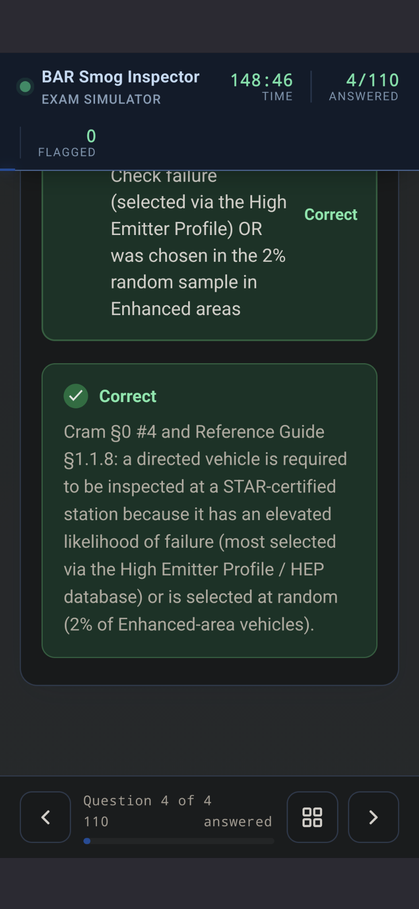
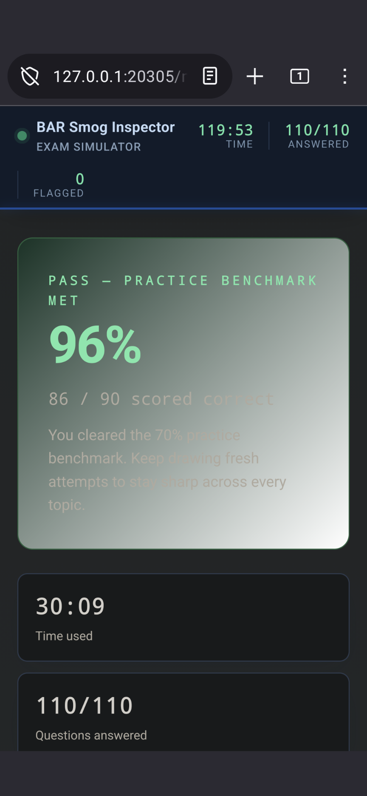
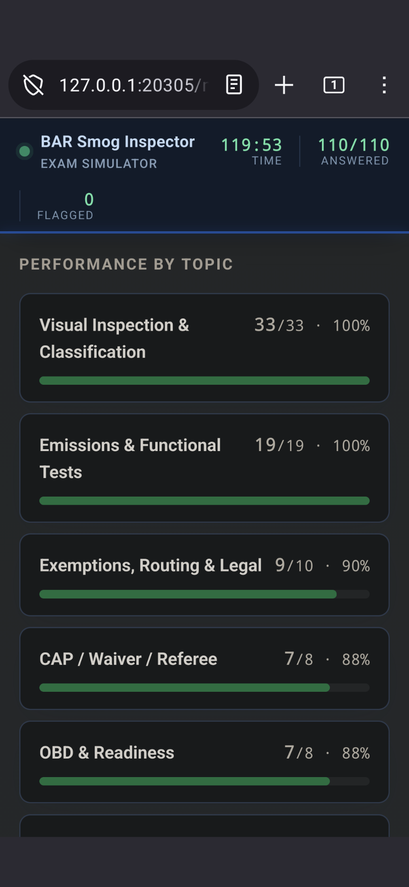

# BAR Smog Inspector Exam Simulator — Opus Edition 🚗💨

**420 unique, high-quality questions** to help you pass the California BAR Smog Inspector Certification exam.

> Built with ❤️ by a fellow tech who passed the exam and wanted everyone else to have a fair shot—completely free, forever.

## 🧠 About This Simulator

This version was crafted in collaboration with **Opus AI**, generating a massive bank of 420 carefully vetted questions. Every scenario, edge case, and tricky wording has been reviewed to match the real BAR exam's style and difficulty.

Whether you're a new tech, a seasoned pro refreshing your knowledge, or an instructor looking for training material—this tool is for you.

## 📸 Screenshots

  
  &nbsp;&nbsp;
  

  
  &nbsp;&nbsp;
  

  <em>Scenario questions · instant explanations with reference citations · pass benchmark · per-topic performance breakdown</em>

## ✨ Features

- ✅ **420 Unique Questions** covering Visual Inspection, Vehicle Verification, Emissions, OBD Readiness, Routing, Exemptions, EO/Mods, CAP/Waiver, and Gross Polluter.
- ⏱️ **150-Minute Timer** mirroring the real exam pressure.
- 💡 **Instant Explanations** on every answer, with references to the relevant handbook sections.
- 📊 **Performance by Topic** with a pass/fail benchmark so you know exactly where to focus.
- 🚩 **Flag Questions** to review later.
- 📈 **Live Stats** (Answered / Flagged / Time Remaining).
- 📱 **Mobile-Responsive** — study on your phone during lunch breaks!
- 🆓 **100% Free** — no paywalls, no sign-ups, no data tracking.

## 🚀 How to Use

1. Open the live site: <https://smogcheckfan.github.io/BAR-Smog-Inspector-Exam-Opus/>
2. Click **Start Exam**.
3. Answer each question to the best of your ability.
4. Use the **Flag** button for questions you want to double-check.
5. Hit **Submit** when finished (or let the timer auto-submit).

## 🌊 The Smog Inspector Simulator Fleet

I've built multiple versions using different AI models to maximize question variety and depth. Try them all!

| Simulator            | Partner  | Questions | Status         | Link                                                                          |
| -------------------- | -------- | --------- | -------------- | ----------------------------------------------------------------------------- |
| DeepSeek Edition     | DeepSeek | 320       | ✅ Live         | [Take me there](https://smogcheckfan.github.io/BAR-Smog-Inspector-Simulator/) |
| Opus Edition         | Opus     | 420       | ✅ Live         | [Take me there](https://smogcheckfan.github.io/BAR-Smog-Inspector-Exam-Opus/) |
| Qwen Edition         | Qwen     | 319       | 🚀 Coming Soon  | —                                                                             |
| *(More coming soon)* | —        | —         | 🏗️ In progress | —                                                                             |

## ⚠️ Disclaimer

This is an unofficial study aid and is not affiliated with, endorsed by, or sponsored by the California Bureau of Automotive Repair (BAR) or any state agency. All questions are original and AI-generated for practice purposes only; they do not reproduce actual exam content. Always consult official BAR materials and current regulations when preparing for certification.

## 🤝 Contributing

Found a typo? Think a question could be phrased better? Have a tricky real-world scenario to add?

- Open an **Issue** on this repo.
- Or submit a **Pull Request** with your changes.

Let's make this the best free study resource on the internet—together.

## 🙏 Acknowledgements

- **The BAR Handbook** — for the regulatory framework.
- **Opus AI** — for generating a massive, high-quality question bank.
- **Every smog tech out there** — keep our air clean and our cars safe.

## 📜 License

This project is open source under the MIT License — see the [LICENSE](LICENSE) file for details.

---

**Remember:** A rising tide lifts all ships. Study hard, pass the exam, and pay it forward. 🙌

